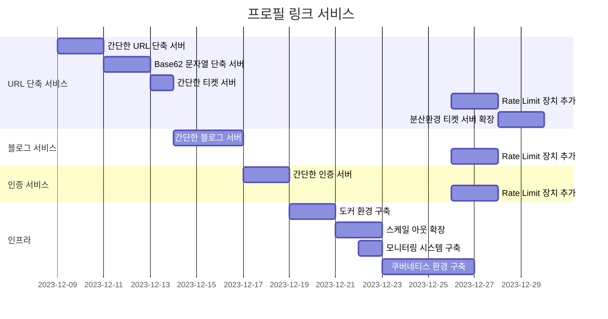

## 프로필 링크 서비스

자신만의 서비스를 모두 보여주기엔 SNS 자기소개 칸은 한 없이 부족합니다.  
프로필 링크 서비스로 차별화된 나만의 서비스를 소개할 수 있습니다.

## 목표
- Tech
  - Service
    - 1월 초까지 가장 간단한 구현부터 복잡한 구현까지 순서대로 2~3일 주기로 업데이트합니다.
    - 멀티 모듈로 기능을 확장합니다. 같은 코드를 가지는 공통 모듈의 범위를 확정합니다.
    - 대규모 설계 시스템 기초 도서의 구현을 실습합니다.
      - 단축 주소를 만들어내는 Base62, 분산 환경에서 고유 번호를 생성하는 Twitter Snowflake, 단축 주소를 확률적으로 조회하는 Bloom Filter 등을 구현합니다.
  - Infra
    - 도커 컴포즈 구조로 확장합니다. 스케일 아웃이 가능한 API 서버와 데이터베이스 분산 구조로 구성합니다.
    - 분산 구조를 모니터링하는 시스템을 구축합니다. 분산 환경에서 필요한 지표를 선별하는 경험을 합니다.
    - 쿠버네티스 환경으로 확장합니다. 도커 컴포즈의 단점과 쿠버네티스를 사용하는 이유를 발견합니다. 헬름 차트의 사용법과 쿠버네티스의 개념을 익힙니다.
- Soft Skill
  - 단계마다 `README.md` 으로 아키텍쳐 구조, 시퀀스 다이어그램, 이론 설명 등의 `데이터`를 기록합니다.
  - 일 주일에 한 번 성찰 회고를 작성합니다.
    - 주변 사람들에게 피드백을 요청합니다. 주위 사람에게 피드백을 `Tech` / `Soft Skill` 에 관한 피드백을 받습니다.
      - 주변 사람들은 관련된 모든 사람들에게 요청합니다.
      - 더 나은 피드백 요청이 될 수 있도록 피드백 요청 또한 피드백을 받습니다.
    - `데이터`와 `피드백`을 바탕으로 성찰 회고를 작성합니다.

## 기능 구현
기능은 단계별로 구현했습니다.  
이는 브랜치로 구분했습니다.  
단계 브랜치 목록은 아래와 같습니다.

* `step1/url-shortner-simple` : 가장 간단한 URL 단축 서비스입니다. 고유 ID 가 1씩 올라가는 RDBMS 특성을 이용해 원래 주소와 매핑해 리다이렉션 기능을 제공합니다.
* `step2/url-shortner-simple-base62` : 고유 ID를 Base62으로 문자열 단축 주소를 구성합니다.
* `step3/url-shortner-ticket` : 고유 키를 생성하는 티켓 서버를 구축합니다. 단축 API 서버에서 연동합니다.
* `step4/blog-simple` : 가장 간단한 블로그 서비스입니다. 인증 기능은 없습니다. 프로필 링크를 추가 / 편집 / 삭제합니다.
* `step5/authentication-simple` : 가장 간단한 인증 서버입니다. API 키를 발급받아 호출합니다.
* `step6/docker-compose` : docker-compose 환경으로 확장합니다.
* `step7/scale-out` : 스케일 아웃을 고려한 분산 환경으로 확장합니다.
* `step8/monitoring` : `Prometheus` & `Grafana` 도구로 모니터링 시스템을 구축합니다.
* `step9/k8s` : 쿠버네티스 환경으로 확장합니다.
* `step10/rate-limit` : 처리율 제한 장치를 추가합니다.
* `step11/distributed-ticket-server` : 분산 환경에서 동작하는 티켓 서버로 확장합니다.

## 갠트 차트

## 목표 아키텍처

## 레퍼런스

### 1. 리틀리, 올인원 프로필 링크 서비스

