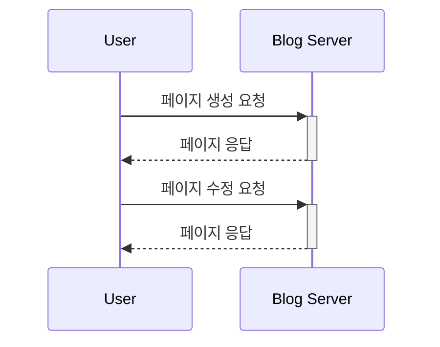
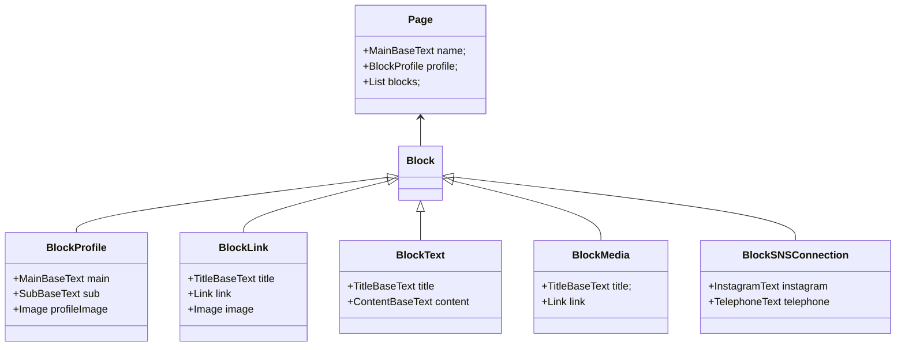

## Step 4. Simple Blog

프로필 링크 페이지를 만듭니다.  
블럭들을 만들고, 수정하고, 삭제합니다.  
한 페이지에 프로필 블럭, 텍스트 블럭, 미디어 블럭, 링크 블럭, SNS 블럭을 편집합니다.  


## 실행하는 법
```bash
$ ./gradlew clean build
$  java -jar blog-api/build/libs/blog-api-XXX.jar
```

## IDE에서 Lombok 어노테이션 처리 활성화

IntelliJ IDE 에서 어노테이션 처리 활성화해야 Lombok 플러그인이 동작합니다.


## 시퀀스 다이어그램



## 아키텍처


## Domain Class DIagram


