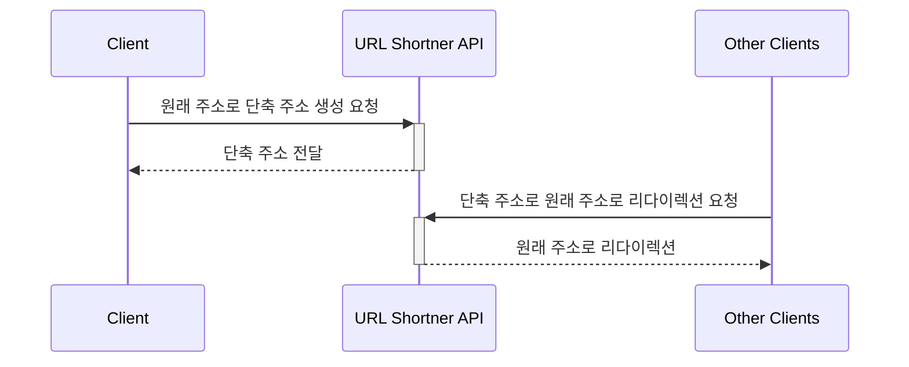

## Step 1. URL Shortner Simple

가장 간단한 URL 단축 API 서버 입니다.  
고유 ID가 1씩 올라가는 RDBMS 기본키 기능을 이용합니다.  
어떤 ID에 저장된 원래 주소로 리다이렉션을 지원합니다.

## 실행하는 법
```bash
$ ./gradlew clean build
$  java -jar url-shortner-api/build/libs/url-shortner-api-XXX.jar
```

## 시퀀스 다이어그램



## 아키텍처

추후 수정

