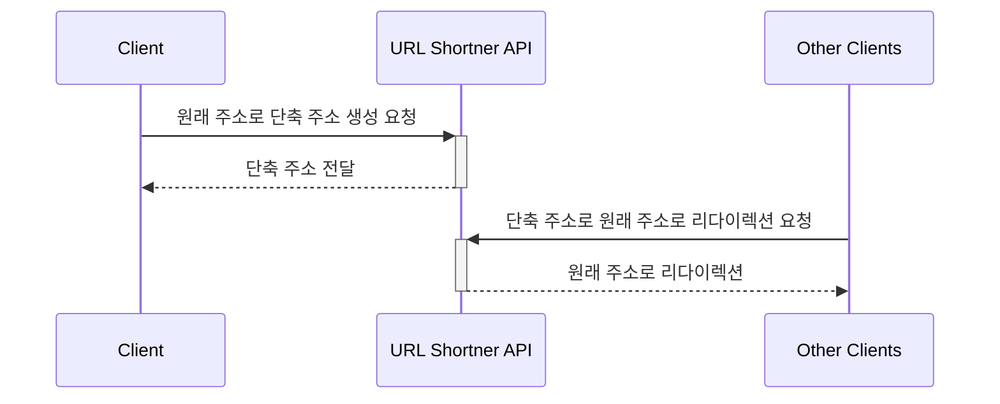

## Step 2. URL Shortner Simple Base62

Base62 는 `0-9A-Za-z` 문자 테이블을 기반으로 숫자 또는 바이트 배열을 암호화 / 복호화합니다.  
Step 1. 에선 단축 주소의 기본키(정수)로 단축 주소를 구성했습니다.  
Step 2. 에선 기본키를 Base62 으로 암호화한 문자열을 단축 주소로 구성합니다.  

`0-9A-Za-z` 순서의 문자 테이블은 다음 기본키의 단축 주소를 예측할 수 있습니다.  
순서를 셔플해 최대한 다음 기본키의 단축 주소를 예측할 수 없도록 방지했습니다.

## 실행하는 법
```bash
$ ./gradlew clean build
$  java -jar url-shortner-api/build/libs/url-shortner-api-XXX.jar
```

## IDE에서 Lombok 어노테이션 처리 활성화

IntelliJ IDE 에서 어노테이션 처리 활성화해야 Lombok 플러그인이 동작합니다.


## 시퀀스 다이어그램



## 아키텍처


