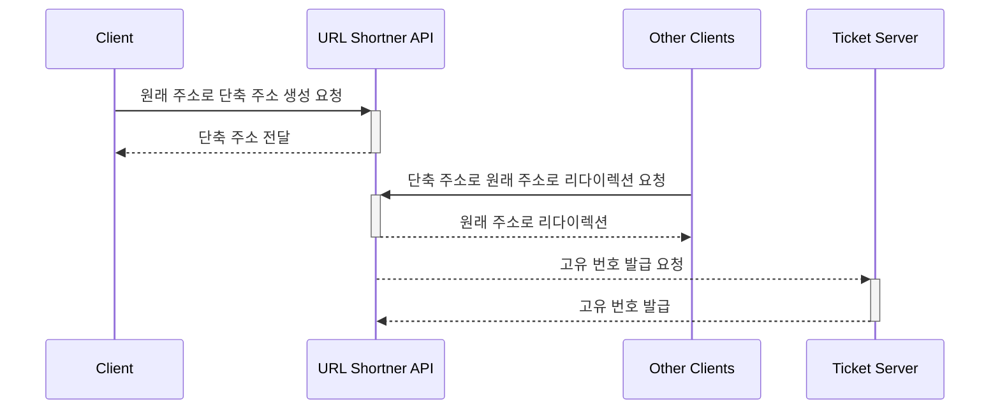

## Step 3. URL Shortner Ticket

티켓 서버는 고유 번호를 관리하는 서버입니다.  
분산 시스템을 위한 유일 고유 번호 생성기입니다.  
단축 서버에서 요청하면 고유 번호를 발급해줍니다.

## 실행하는 법
```bash
$ ./gradlew clean build
$  java -jar url-shortner-api/build/libs/url-shortner-api-XXX.jar
```

## IDE에서 Lombok 어노테이션 처리 활성화

IntelliJ IDE 에서 어노테이션 처리 활성화해야 Lombok 플러그인이 동작합니다.


## 시퀀스 다이어그램



## 아키텍처


